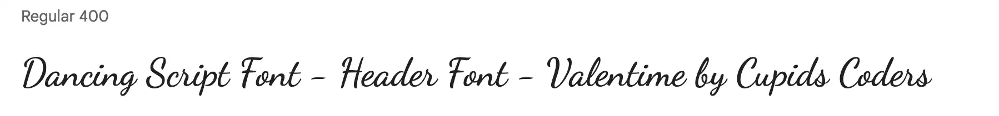
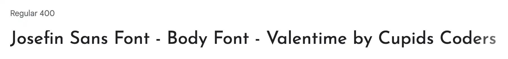
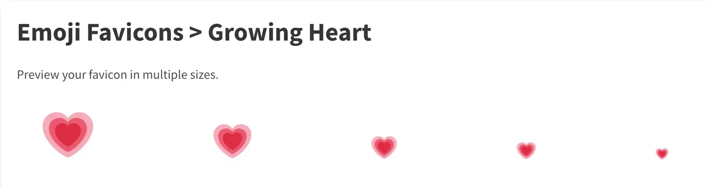

# VALENTIME

Created for the Code Institute's February 2022 Hackathon, Love is in the air.

Valentime: Spend more time creating memories!

During lockdown, we had to rethink what a date night was. The local pub was closed, we were unable to eat at our favourite restaurants, and there were no new films showing at the cinemas.

It would have been great to have a site where a suitable at home date night idea could be randomly selected for you ... so we decided to make that idea a reality!

By using the Valentime site to randomly generating a date night idea based on the category you select, you will have more time to spend on the important stuff - making memories with your loved one ❤️.

And as love comes in all different forms, from self love, the love of a friend group to romantic love - we have created seperate sections for each of these - so leave the pain of choosing what to do in the past, and start using Valentime today!

Add site responsive screenshot here

[Visit the Valentime site here](https://tindyc.github.io/valentime/)

## CONTENTS

* [User Experience (UX)](#User-Experience-(UX))
  * [User Stories](#User-Stories)

* [Design](#Design)
  * [Colour Scheme](#Colour-Scheme)
  * [Typography](#Typography)
  * [Imagery](#Imagery)
  * [Wireframes](#Wireframes)
  * [Features](#Features)
  * [Accessibility](#Accessibility)

* [Technologies Used](#Technologies-Used)
  * [Languages Used](#Languages-Used)
  * [Frameworks, Libraries & Programs Used](#Frameworks,-Libraries-&-Programs-Used)

* [Deployment & Local Development](#Deployment-&-Local-Development)
  * [Deployment](#Deployment)
  * [Local Development](#Local-Development)
    * [How to Fork](#How-to-Fork)
    * [How to Clone](#How-to-Clone)

* [Testing](#Testing)
  * [W3C Validator](#W3C-Validator)
  * [JavaScript Validator](#JavaScript-Validator)
  * [Solved Bugs](#Solved-Bugs)
  * [Known Bugs](#Known-Bugs)
  * [Testing User Stories](#Testing-User-Stories)
  * [Lighthouse](#Lighthouse)
  * [Full Testing](#Full-Testing)
  
* [Credits](#Credits)
  * [Code Used](#Code-Used)
  * [Content](#Content)
  * [Media](#Media)
  * [Acknowledgments](#Acknowledgments)

- - -

## User Experience (UX)

### User Stories

#### First Time Visitor Goals

* As a first time user, I want to be able to find out what the valentime site is about.
* I want to be able to see what categories there are for date night ideas.

#### Returning Visitor Goals

* As a returning visitor of the site I want to be able to try different date night ideas depending on who will be participating. I may have tried a date night idea with a partner, and now I want to see what the site can suggest for a date night with a group of friends.
* As a returning visitor to the site, I want to be able to share date night ideas with my loved ones.

#### Frequent Visitor Goals

* As a frequent user of the site I want to be able to contact Valentime and suggest new date night ideas.
* As a frequent visitor to the site, I want to be able to subscribe to the Valentime Youtube channel.

- - -

## Design

### Colour Scheme

As the theme of the site is all about love, we chose to use the classic romantic colours of reds and pinks. We have chosen some complementary colours that stand out from the pink to be used throughout the site.

### Typography

Google Fonts was used to import the chosen fonts for use in the site.

* We are using [Dancing Script](https://fonts.google.com/specimen/Dancing+Script?query=dancing+script) for the headers on the site.
  

* We are using [Josefin Sans](https://fonts.google.com/specimen/Josefin+Sans?query=josefin+sans) for the body of the site.
  

### Imagery

### Wireframes

Wireframes were created for mobile, tablet and desktop with [Balsamiq](https://balsamiq.com/)

Wireframes links/images to go here

### Features

The website is comprised of:

1. Home page.
2. Movies page.
3. Food and drink page.
4. Games night page.
5. Contact us page.

All Pages on the website have:

* A favicon icon.
    
* A responsive navbar.
    
* A responsive footer.
    

* Future Implementations.

  * Add further theme categories for date nights in the future and expand on the number of ideas in each category.
  * Implement a log in function so that people could save ideas they like.
  * Add a rating system for people to rate the date ideas.

### Accessibility

We have been mindful during coding to ensure that the website is as accessible friendly as possible. This has been have achieved by:

* Using semantic HTML.
* Using descriptive alt attributes on images on the site.
* Providing information for screen readers where there are icons used and no text.
* Ensuring that there is a sufficient colour contrast throughout the site.

- - -

## Technologies Used

### Languages Used

HTML, CSS, Javascript, Bootstrap5

### Frameworks, Libraries & Programs Used

Balsamiq - Used to create wireframes.

Git - For version control.

Github - To save and store the files for the website.

Google Fonts - To import the fonts used on the website.

Font Awesome - For the iconography on the website.

Google Dev Tools - To troubleshoot and test features, solve issues with responsiveness and styling.

[Tiny PNG](https://tinypng.com/) To compress images.

[Birme](https://www.birme.net/) To resize images and convert to webp format.

[Favicon.io](https://favicon.io/) To create favicon.

[Am I Responsive?](http://ami.responsivedesign.is/) To show the website image on a range of devices.

[Shields.io](https://shields.io/) To add badges to the README

[Canva](https://www.canva.com/) To create Greyscale

- - -

## Deployment & Local Development

### Deployment

The site is deployed using GitHub Pages.

### Local Development

#### How to Fork

To fork the repository:

1. Log in (or sign up) to Github.
2. Go to the repository for this project, [valentime](https://github.com/tindyc/valentime).
3. Click the Fork button in the top right corner.

#### How to Clone

To clone the repository:

1. Log in (or sign up) to GitHub.
2. Go to the repository for this project, [valentime](https://github.com/tindyc/valentime).
3. Click on the code button, select whether you would like to clone with HTTPS, SSH or GitHub CLI and copy the link shown.
4. Open the terminal in your code editor and change the current working directory to the location you want to use for the cloned directory.
5. Type 'git clone' into the terminal and then paste the link you copied in step 3. Press enter.

- - -

## Testing

Testing was ongoing throughout the entire build. We utilised Chrome developer tools while building to pinpoint and troubleshoot any issues as we went along.

### W3C Validator

The W3C validator was used to validate the HTML on all pages of the website. It was also used to validate CSS.

W3C validator images or links to go here

### JavaScript Validator

** was used to validate the JavaScript used.

### Solved Bugs

### Known Bugs

### Testing User Stories

* First Time Visitors

* Returning Visitors

* Frequent Visitors

### Lighthouse

We used Lighthouse within the Chrome Developer Tools to test the performance, accessibility, best practices and SEO of the website.

### Full Testing

To fully test my website we performed the following testing using a number of browsers (google chrome) and devices (Macbook Pro 14 inch, iPhone 13 pro).

We also went through each page using google chrome developer tools to ensure that they were responsive on all different screen sizes.

- - -

## Credits

### Code Used

### Content

### Media

#### Index Page

Images acquired under licence from Adobe Stock:
[Clapperboard](https://stock.adobe.com/uk/search/images?filters%5Bcontent_type%3Aphoto%5D=1&filters%5Bcontent_type%3Aillustration%5D=1&filters%5Bcontent_type%3Azip_vector%5D=1&filters%5Bcontent_type%3Aimage%5D=1&k=hearts+clapperboard&order=relevance&price%5B%24%5D=1&safe_search=1&limit=100&search_page=1&search_type=usertyped&acp=&aco=hearts+clapperboard&get_facets=0&asset_id=478864574) | [Heart Biscuits](https://stock.adobe.com/uk/search/images?filters%5Bcontent_type%3Aphoto%5D=1&filters%5Bcontent_type%3Aillustration%5D=1&filters%5Bcontent_type%3Azip_vector%5D=1&filters%5Bcontent_type%3Aimage%5D=1&k=hearts+biscuit&order=relevance&price%5B%24%5D=1&safe_search=1&limit=100&search_page=1&search_type=autosuggest&acp=0&aco=hearts+bis&get_facets=0&asset_id=238249922) | [Heart Dice](https://stock.adobe.com/uk/search/images?k=dice+hearts&search_type=usertyped&asset_id=131839808)

#### Movies Page

#### Category Images
[Solo Man](https://pixabay.com/photos/tv-man-watching-room-office-3774381/) |
[Couple](https://www.rawpixel.com/image/404399/free-photo-image-remote-control-couple-woman-watching) |
[Group](https://www.rawpixel.com/image/391714/free-photo-image-surprised-scared-movie)

##### Film Suggestions Images

* Solo

  [How to be single](https://www.imdb.com/title/tt1292566/mediaviewer/rm1563878144/) | [Romie & Micheles High School reunion](https://www.imdb.com/title/tt0120032/mediaviewer/rm3693776641/) | [La la land](https://www.imdb.com/title/tt3783958/mediaviewer/rm3967749632/) | [He's just not that into you](https://www.imdb.com/title/tt1001508/mediaviewer/rm2221312512/) | [Magic Mike](https://www.imdb.com/title/tt1915581/mediaviewer/rm2370876672/)

* Couple

  [Romeo & Juliet](https://image.tmdb.org/t/p/original/zWLZEUE0jrTiLhWQVh8NOJRwIU9.jpg) | [The Vow](https://www.imdb.com/title/tt1606389/mediaviewer/rm2093465088/) | [Sleepless in Seattle](https://www.imdb.com/title/tt0108160/mediaviewer/rm2444975104/) | [The Notebook](https://www.imdb.com/title/tt0332280/mediaviewer/rm1153669376/) | [The wedding singer](https://www.imdb.com/title/tt0120888/mediaviewer/rm2194422016/)

* Group

  [Girls trip](https://www.imdb.com/title/tt3564472/mediaviewer/rm3929943808/) | [The sweetest thing](https://www.imdb.com/title/tt0253867/mediaviewer/rm1028787712/) | [The proposal](https://www.imdb.com/title/tt1041829/mediaviewer/rm2227985664/) | [My best friends wedding](https://www.imdb.com/title/tt0119738/mediaviewer/rm691035136/) | [Someone great](https://www.imdb.com/title/tt8075260/mediaviewer/rm2056744192/)

#### Food & Drinks Page

#### Category Images
[Dinner Table](https://www.pexels.com/photo/candles-cutlery-flatware-fork-290524/) |
[Glasses With Cocktails](https://www.pexels.com/photo/glasses-with-alcoholic-beverages-5379762/) |
[Macarons Around A Cake](https://www.pexels.com/photo/macarons-around-a-pink-cake-4887830/) |

#### Games Night Page

#### Contact Us Page

The images of each team member belong to the individual.
- - -
### Acknowledgments

Meet team Cupids Coders :

* [Ionut Zapototchi](https://github.com/lseparatio)
* [Kelven Hughes](https://github.com/KelvenH)
* [Kera Cudmore](https://github.com/kera-cudmore)
* [Pratima Gurav](https://github.com/PratimaGurav)
* [Tindy Chan](https://github.com/tindyc)

We would like to thank the following:

* [Naoise Gaffney](https://github.com/NaoiseGaffney), our facilitator for this hackathon.

* Our families, for their endless patience while we disappear for another long weekend of hackathon coding.
